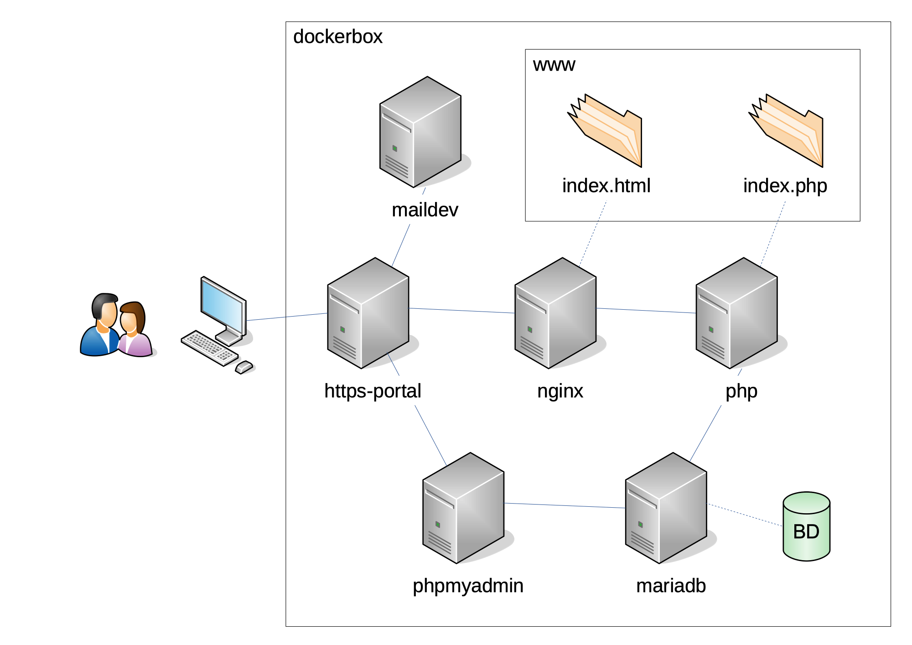

# dockerbox

Entorno de desarrollo para programación web con Docker.

## Instalación

1. Instalar Docker para [Windows y macOS](https://www.docker.com/products/docker-desktop) o [Ubuntu](https://docs.docker.com/install/linux/docker-ce/ubuntu/).
2. Clonar este repositorio.
3. Editar el fichero `/etc/hosts` como root y añadir:

	```
	127.0.0.1	dockerbox.test
	127.0.0.1	phpmyadmin.dockerbox.test
	127.0.0.1	maildev.dockerbox.test
	```

4. En un terminal, situarse en la carpeta `dockerbox`:

	```sh
	cd dockerbox
	```

5. Copiar el fichero `env-example` a `.env`:

	```sh
	cp env-example .env
	```
	
	Es recomendable cambiar las contraseñas por defecto.

6. Arrancar los servicios:

	```sh
	docker-compose up -d
	```

## Servicios

- [Sitio web](https://dockerbox.test)
- [phpMyAdmin](https://phpmyadmin.dockerbox.test)
- [MailDev](https://maildev.dockerbox.test)

## Utilidades

- Acceso mediante shell: 

	```sh
	docker-compose exec php /bin/sh
	```

## Depurar con Xdebug y PhpStorm

1. Modificar el fichero `.env` añadiendo la dirección IP del ordenador en la variable `XDEBUG_REMOTE_HOST`.
2. Habilitar la escucha de conexiones de depuración en PhpStorm haciendo click en el icono: 
3. Fijar un _breakpoint_ y cargar la página en el navegador.

## Habilitar el puerto de MariaDB en localhost

1. Editar el fichero `docker-compose.override.yml` y añadir:

	```yml
	  mariadb:
	    ports:
	      - 3306:3306
	```

2. Recrear el contenedor `mariadb` para que se aplique el cambio:

	```sh
	docker-compose up -d mariadb
	```

## Estructura de dockerbox


